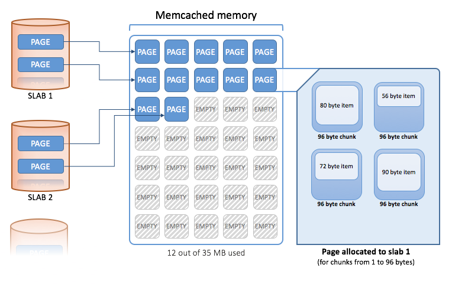

## Memcached

### Introduction

Memcached is an in-memory key-value store for small chunks of arbitrary data (strings, objects) from results of database calls, API calls, or page rendering.

Memcached exposes TCP port 11211

To connect to a Memcached server, you need to use the telnet command on HOST and PORT names.

If you have access to a memcahed database you can do the following

1. **stats slabs**: Print the slabs that have created and allocated for storing information within the cache. You get information both on each individual slab-class and total statistics for the whole slab.
Individual stats for each slab class are prefixed with the slab ID.

2. **stats cachedump *slabs_id* 0**: Allows us to get the keys names associated to those slab
3. **get *key***: Get the content of a key

###### *If you don't know, now you know: [Memcached](https://medium.com/@SkyscannerEng/journey-to-the-centre-of-memcached-b239076e678a)*

- Keys are were data is stored and retrieved from Memcached.
- Memcached organises its memory in [slabs](https://en.wikipedia.org/wiki/Slab_allocation) which are predetermined lists for objects of the same size range.
- Memcached uses page, which are memory area of 1MB that contains as many chunks as will fit.

##### References:

https://amriunix.com/post/memcached-enumeration/
https://serverfault.com/questions/207356/view-content-of-memcached/674104
https://medium.com/@SkyscannerEng/journey-to-the-centre-of-memcached-b239076e678a